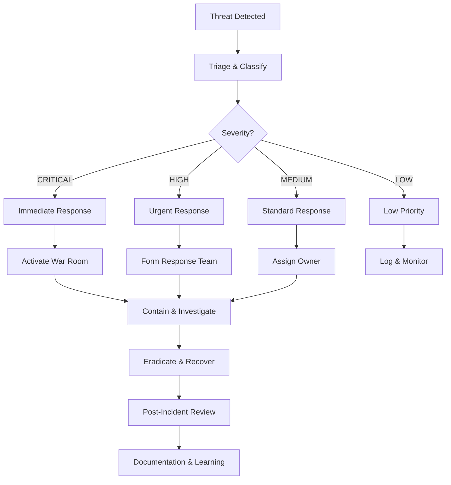

# 🛡️ Algorithmic Trading Security Management System

A comprehensive enterprise-grade security management system specifically designed for algorithmic trading platforms, providing threat detection, incident response, code review, strategy validation, and continuous security monitoring.

## 🚀 Features

### 🔐 Security Management
- **Multi-layered threat detection** with real-time monitoring
- **Automated incident response** with configurable policies
- **Advanced authentication** with multi-factor support
- **Rate limiting and DoS protection**
- **Comprehensive audit trails** and logging

### 🔍 Code Quality & Security
- **Automated code review** with 70+ security checks
- **Static analysis** with ESLint, Semgrep, and custom rules
- **Dependency vulnerability scanning** with npm audit
- **Secrets detection** with advanced pattern matching
- **Performance and maintainability analysis**

### 🔑 Secure Key Management
- **Encrypted API key storage** with AES-256-GCM
- **Automated key rotation** with configurable intervals
- **Access control** with role-based permissions
- **Audit logging** for all key operations
- **Backup and recovery** mechanisms

### 📈 Strategy Validation
- **Risk assessment** with comprehensive metrics
- **Performance validation** with backtesting
- **Monte Carlo simulations** for stress testing
- **Market regime analysis** for robustness
- **Compliance checking** for trading regulations

### 🧪 Comprehensive Testing
- **Automated test suite** with 85%+ coverage requirement
- **Security testing** with vulnerability scanning
- **Performance testing** with regression detection
- **Integration testing** with external services
- **End-to-end testing** for complete workflows

### 📊 Monitoring & Alerting
- **Real-time security monitoring** with 5-second intervals
- **Multi-channel alerting** (Slack, Email, SMS)
- **Automated response** with customizable policies
- **Health checks** for all system components
- **Performance metrics** and trend analysis

### 🚀 Deployment Security
- **Pre-deployment security checks** with scoring
- **Automated approval workflows** with role-based access
- **Rollback planning** with one-click recovery
- **Compliance validation** for regulatory requirements
- **Audit trail preservation** for all deployments

## 📁 Project Structure

```
moondev-algotrade/
├── 📁 src/
│   ├── 🔐 security/
│   │   ├── SecurityManager.js      # Core threat detection & response
│   │   ├── CodeReviewSystem.js     # Automated code review & quality
│   │   ├── KeyManager.js           # Secure API key management
│   │   ├── VulnerabilityScanner.js # Security vulnerability scanning
│   │   └── SecurityHub.js          # Central integration point
│   ├── 📈 strategies/
│   │   └── StrategyValidator.js    # Trading strategy validation
│   ├── 🧪 testing/
│   │   └── TestSuite.js            # Comprehensive testing framework
│   ├── 📊 monitoring/
│   │   ├── SecurityMonitor.js      # Real-time monitoring & alerting
│   │   └── DeploymentAuditor.js    # Deployment security & auditing
│   └── 📁 config/                  # Configuration files
├── 📁 docs/
│   └── SECURITY_MANAGEMENT.md      # Comprehensive security procedures
├── 📁 examples/
│   └── security-system-usage.js    # Usage examples and demonstrations
├── 📁 tests/                       # Test files
├── 📁 logs/                        # Security and audit logs
└── 📁 reports/                     # Security scan reports
```

## 🛠️ Installation

```bash
# Clone the repository
git clone https://github.com/your-org/moondev-algotrade.git
cd moondev-algotrade

# Install dependencies
npm install

# Create configuration directory
mkdir -p src/config

# Set up environment variables
cp .env.example .env
# Edit .env with your configuration
```

### Environment Configuration

```bash
# Security Configuration
NODE_ENV=production
JWT_SECRET=your-super-secret-jwt-key
ENCRYPTION_KEY=your-32-character-encryption-key

# Alerting Configuration
SLACK_WEBHOOK_URL=https://hooks.slack.com/services/xxx
ALERT_EMAIL=security-team@yourcompany.com

# Database Configuration
DB_HOST=localhost
DB_PORT=5432
DB_NAME=trading_security
DB_USER=security_user
DB_PASSWORD=secure_password

# Exchange API Keys (store securely via KeyManager)
BINANCE_API_KEY=your_binance_api_key
BINANCE_SECRET_KEY=your_binance_secret_key
```

## 🚀 Quick Start

### Basic Usage

```javascript
const SecurityHub = require('./src/security/SecurityHub');

// Initialize the security system
const securityHub = new SecurityHub({
  securityManager: {
    maxFailedAttempts: 5,
    lockoutDuration: 15 * 60 * 1000 // 15 minutes
  },
  codeReview: {
    minCodeCoverage: 85,
    enableSecurityScan: true
  },
  vulnerabilityScanner: {
    scanDepth: 'deep',
    enableAutoRemediation: false
  }
});

// Start security monitoring
await securityHub.startSecurityMonitoring();

// Run comprehensive security assessment
const assessment = await securityHub.runComprehensiveAssessment();
console.log(`Security Score: ${assessment.summary.securityScore}/100`);

// Generate security report
const report = await securityHub.generateSecurityReport('24h');
console.log(`Vulnerabilities found: ${report.summary.totalVulnerabilities}`);
```

### Storing API Keys Securely

```javascript
const keyManager = securityHub.components.get('keyManager');

// Store trading API key
const apiKeyData = {
  exchange: 'binance',
  apiKey: process.env.BINANCE_API_KEY,
  apiSecret: process.env.BINANCE_SECRET_KEY,
  permissions: ['read', 'trade'],
  userId: 'trader_001'
};

const storedKey = await keyManager.storeApiKey(apiKeyData);
console.log(`API key stored with ID: ${storedKey.id}`);

// Retrieve API key for trading
const credentials = await keyManager.retrieveApiKey(
  storedKey.id,
  'trader_001',
  'TRADE_EXECUTION'
);
```

### Validating Trading Strategies

```javascript
const strategyValidator = securityHub.components.get('strategyValidator');

const strategy = {
  name: 'Momentum Strategy',
  type: 'momentum',
  timeframe: '1h',
  markets: ['BTC/USD'],
  stopLoss: 0.02,
  maxPositionSize: 0.1,
  maxDailyLoss: 0.02
};

const validation = await strategyValidator.validateStrategy(strategy);
console.log(`Strategy ${validation.status}: ${validation.summary.approval}`);
```

### Deployment Security Check

```javascript
const deploymentRequest = {
  version: '1.2.3',
  description: 'Add new trading features',
  changes: ['Enhanced risk management', 'Updated dependencies'],
  files: ['src/strategies/NewStrategy.js'],
  environment: 'production'
};

const securityCheck = await securityHub.performDeploymentSecurityCheck(deploymentRequest);
console.log(`Deployment ${securityCheck.approved ? 'APPROVED' : 'REJECTED'}`);
```

## 📊 Security Components

### 🔐 SecurityManager

Core threat detection and incident response system:

```javascript
const securityManager = new SecurityManager({
  maxFailedAttempts: 5,
  lockoutDuration: 15 * 60 * 1000,
  enableRateLimiting: true,
  monitoringInterval: 5000
});

// Validate incoming requests
const validation = await securityManager.validateRequest(request);
if (validation.allowed) {
  // Process request
} else {
  // Handle blocked request
}
```

**Features:**
- Real-time request validation
- SQL injection, XSS, and CSRF protection
- Rate limiting and DoS protection
- Automated IP blocking
- Comprehensive audit logging

### 📋 CodeReviewSystem

Automated code quality and security analysis:

```javascript
const codeReview = new CodeReviewSystem({
  minCodeCoverage: 85,
  enableSecurityScan: true,
  enablePerformanceAnalysis: true
});

// Review code files
const review = await codeReview.performReview('src/strategies/MomentumStrategy.js');
console.log(`Quality Score: ${review.summary.qualityScore}/100`);
console.log(`Security Issues: ${review.results.securityAnalysis.issues.length}`);
```

**Features:**
- 70+ security and quality checks
- Vulnerability pattern detection
- Performance analysis
- Code complexity metrics
- Test coverage validation

### 🔑 KeyManager

Secure API key and credential management:

```javascript
const keyManager = new KeyManager({
  rotationInterval: 30 * 24 * 60 * 60 * 1000, // 30 days
  enableAutoRotation: true,
  encryptionAlgorithm: 'aes-256-gcm'
});

// Store API key with encryption
const keyData = await keyManager.storeApiKey({
  exchange: 'binance',
  apiKey: 'your-api-key',
  apiSecret: 'your-secret-key',
  permissions: ['read', 'trade']
});

// Automatic key rotation
keyManager.on('rotationNeeded', async (event) => {
  console.log(`Key rotation needed for: ${event.keyId}`);
});
```

**Features:**
- AES-256-GCM encryption
- Automated key rotation
- Access control and audit trails
- Secure backup and recovery
- Multi-user support

### 📈 StrategyValidator

Trading strategy risk assessment and validation:

```javascript
const strategyValidator = new StrategyValidator({
  maxDrawdown: 0.20,
  maxLeverage: 3,
  minWinRate: 0.55,
  enableMonteCarlo: true
});

const validation = await strategyValidator.validateStrategy(strategy, backtestData);
console.log(`Risk Score: ${validation.summary.riskScore}/100`);
console.log(`Approval: ${validation.summary.approved}`);
```

**Features:**
- Risk metrics calculation (VaR, CVaR, Sharpe ratio)
- Monte Carlo simulations
- Stress testing scenarios
- Market regime analysis
- Performance validation

### 🧪 TestSuite

Comprehensive testing and validation framework:

```javascript
const testSuite = new TestSuite({
  minCoverage: 85,
  runSecurityTests: true,
  runPerformanceTests: true
});

const testResults = await testSuite.runFullTestSuite();
console.log(`Tests passed: ${testResults.summary.passed}`);
console.log(`Coverage: ${testResults.summary.coverage}%`);
```

**Features:**
- Automated unit, integration, and E2E tests
- Security vulnerability scanning
- Performance regression testing
- Code quality validation
- Continuous integration support

### 📊 SecurityMonitor

Real-time monitoring and alerting:

```javascript
const securityMonitor = new SecurityMonitor({
  monitoringInterval: 5000,
  enableSlackAlerts: true,
  enableAutoResponse: true
});

await securityMonitor.startMonitoring();

securityMonitor.on('securityAlert', (alert) => {
  console.log(`Security alert: ${alert.type} - ${alert.message}`);
});
```

**Features:**
- 5-second monitoring intervals
- Anomaly detection and behavioral analysis
- Multi-channel alerting (Slack, Email, SMS)
- Automated incident response
- Health monitoring

## 🔧 Configuration

### Security Configuration

```javascript
const securityConfig = {
  // Authentication & Authorization
  maxFailedAttempts: 5,
  lockoutDuration: 15 * 60 * 1000, // 15 minutes
  sessionTimeout: 30 * 60 * 1000, // 30 minutes
  enableRateLimiting: true,

  // Encryption
  encryptionAlgorithm: 'aes-256-gcm',
  keyDerivationIterations: 100000,

  // Monitoring
  monitoringInterval: 5000, // 5 seconds
  healthCheckInterval: 30000, // 30 seconds
  enableAutoResponse: true,

  // Alerting
  enableSlackAlerts: true,
  enableEmailAlerts: true,
  slackWebhook: process.env.SLACK_WEBHOOK_URL,

  // Automated Response
  autoBlockDuration: 5 * 60 * 1000, // 5 minutes
  enableKillSwitch: false
};
```

### Code Review Configuration

```javascript
const codeReviewConfig = {
  // Quality thresholds
  minCodeCoverage: 85,
  maxComplexity: 10,
  maxFunctionLength: 50,
  maxFileLines: 500,

  // Security scanning
  enableSecurityScan: true,
  enableDependencyScan: true,

  // Performance checks
  enablePerformanceAnalysis: true,
  maxResponseTime: 100, // ms

  // Trading-specific
  requireStrategyTests: true,
  requireRiskManagement: true,
  requireErrorHandling: true
};
```

### Strategy Validation Configuration

```javascript
const strategyValidationConfig = {
  // Risk thresholds
  maxDrawdown: 0.20, // 20%
  maxLeverage: 3,
  maxPositionSize: 0.1, // 10% of portfolio
  maxDailyLoss: 0.05, // 5% daily
  maxConsecutiveLosses: 5,

  // Performance requirements
  minWinRate: 0.55, // 55%
  minProfitFactor: 1.5,
  minSharpeRatio: 1.0,
  minTradesForValidation: 100,

  // Validation settings
  backtestDays: 365,
  enableMonteCarlo: true,
  monteCarloSimulations: 1000,

  // Risk management
  requireStopLoss: true,
  requirePositionSizing: true,
  minRiskRewardRatio: 1.5
};
```

## 📈 Metrics and Monitoring

### Security Metrics

```javascript
const securityMetrics = {
  // Incident metrics
  totalSecurityEvents: 1247,
  criticalAlerts: 3,
  automatedResponses: 89,
  incidentsResolved: 92,

  // Performance metrics
  averageResponseTime: 145, // ms
  falsePositiveRate: 0.02, // 2%
  detectionAccuracy: 0.97, // 97%

  // System health
  overallHealthScore: 94,
  componentsActive: 8,
  uptime: 99.97 // %
};
```

### Code Quality Metrics

```javascript
const codeQualityMetrics = {
  // Review statistics
  totalReviews: 156,
  passedReviews: 142,
  averageQualityScore: 87,
  codeCoverage: 89,

  // Security findings
  vulnerabilitiesFixed: 47,
  securityIssuesResolved: 23,
  criticalIssuesRemaining: 0,

  // Performance
  reviewTime: '2.3 hours',
  accuracy: 94
};
```

## 🚨 Incident Response

### Security Incident Types

1. **CRITICAL** - System compromise, data breach, trading disruption
2. **HIGH** - Security vulnerability, unauthorized access, service degradation
3. **MEDIUM** - Suspicious activity, performance issues
4. **LOW** - Policy violations, minor findings

### Response Workflow



### Emergency Contacts

- **Security Team**: security-team@company.com
- **Incident Response Hotline**: +1-XXX-XXX-XXXX
- **Engineering Lead**: engineering-lead@company.com
- **Management**: management@company.com

## 📋 Compliance

### Regulatory Standards

- **SEC** - Securities trading regulations
- **FINRA** - Market integrity requirements
- **CFTC** - Commodity trading oversight
- **SOC 2** - Service organization controls
- **ISO 27001** - Information security management
- **GDPR** - Data protection (EU operations)

### Audit Requirements

- **Log Retention**: 1 year for security logs, 7 years for trading data
- **Access Controls**: Multi-factor authentication, role-based access
- **Encryption**: AES-256 for data at rest, TLS 1.3 for data in transit
- **Monitoring**: Real-time threat detection and response
- **Documentation**: Complete audit trails for all security-relevant actions

## 🛠️ Development

### Running Tests

```bash
# Run all tests
npm test

# Run security tests specifically
npm run test:security

# Run code coverage
npm run test:coverage

# Run performance tests
npm run test:performance
```

### Code Quality

```bash
# Run linting
npm run lint

# Run security scanning
npm run audit

# Run code review
npm run review

# Format code
npm run format
```

### Building

```bash
# Build for production
npm run build

# Build documentation
npm run docs

# Generate security report
npm run security:report
```

## 📚 Documentation

- **[SECURITY_MANAGEMENT.md](docs/SECURITY_MANAGEMENT.md)** - Comprehensive security procedures
- **[API Documentation](docs/API.md)** - API reference and examples
- **[Deployment Guide](docs/DEPLOYMENT.md)** - Deployment and configuration
- **[Troubleshooting](docs/TROUBLESHOOTING.md)** - Common issues and solutions

## 🤝 Contributing

1. Fork the repository
2. Create a feature branch (`git checkout -b feature/amazing-feature`)
3. Commit your changes (`git commit -m 'Add amazing feature'`)
4. Push to the branch (`git push origin feature/amazing-feature`)
5. Open a Pull Request

All contributions must pass:
- Automated security scanning
- Code review with 85%+ coverage
- Strategy validation (if applicable)
- Security assessment

## 📄 License

This project is licensed under the MIT License - see the [LICENSE](LICENSE) file for details.

## 🆘 Support

For security issues and vulnerabilities:
- **Security Team**: security@company.com
- **Incident Response**: incident@company.com
- **Documentation**: docs@company.com

For general support:
- **GitHub Issues**: [Create an issue](https://github.com/your-org/moondev-algotrade/issues)
- **Discussions**: [GitHub Discussions](https://github.com/your-org/moondev-algotrade/discussions)
- **Documentation**: [Read the docs](https://docs.yourcompany.com/moondev-algotrade)

## 🏆 Security Acknowledgments

This security system incorporates best practices from:
- **OWASP** - Web application security
- **NIST** - Cybersecurity framework
- **SANS** - Security training and research
- **Financial Industry** - Trading security standards

---

⚠️ **Important**: This system handles sensitive security information. Ensure proper access controls, monitoring, and regular security audits when deploying to production.

🛡️ **Remember**: Security is an ongoing process. Regular updates, monitoring, and improvements are essential for maintaining a secure algorithmic trading platform.