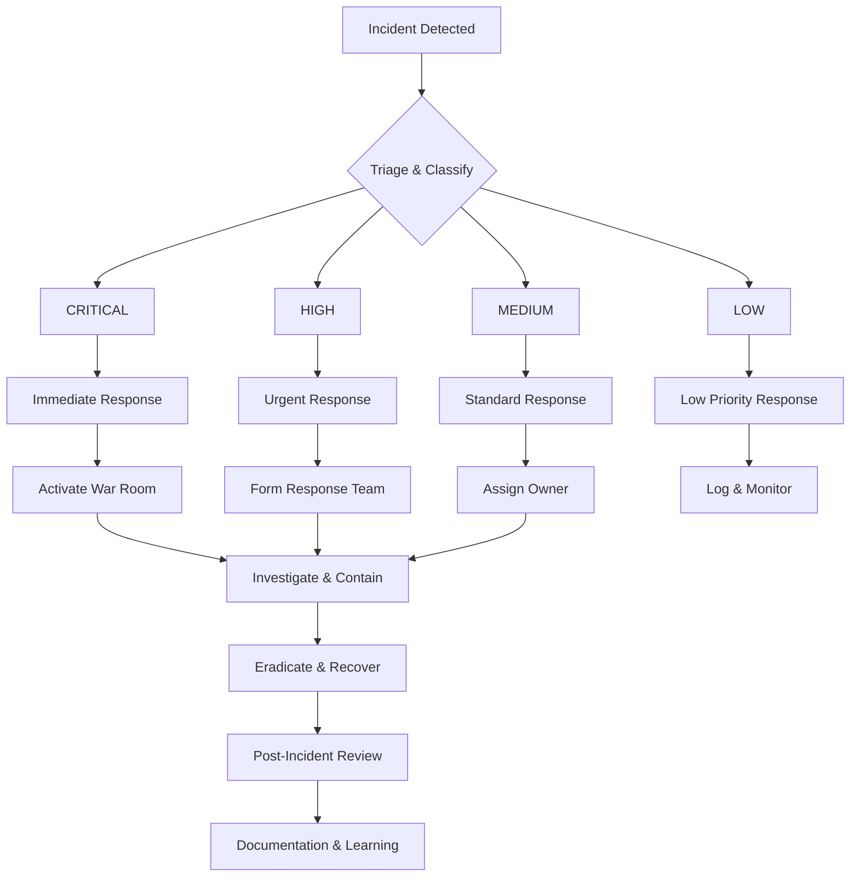

# Security Management and Incident Response Procedures

## Table of Contents

1. [Security Overview](#security-overview)
2. [Security Architecture](#security-architecture)
3. [Incident Response Procedures](#incident-response-procedures)
4. [Security Operations](#security-operations)
5. [Compliance and Auditing](#compliance-and-auditing)
6. [Emergency Procedures](#emergency-procedures)
7. [Security Tools and Systems](#security-tools-and-systems)

## Security Overview

This document outlines comprehensive security management procedures for the algorithmic trading platform, including threat detection, incident response, and compliance requirements.

### Security Principles

- **Zero Trust Architecture**: No implicit trust, verify everything
- **Defense in Depth**: Multiple layers of security controls
- **Principle of Least Privilege**: Minimum necessary access only
- **Continuous Monitoring**: Real-time threat detection and response
- **Rapid Incident Response**: Predefined procedures for security incidents

## Security Architecture

### Multi-Layered Security Controls

```
┌─────────────────────────────────────────────────────────────┐
│                    Application Layer                         │
│  ┌─────────────────┐  ┌─────────────────┐  ┌──────────────┐ │
│  │   Code Review   │  │  Security Test  │  │ Static Analysis│ │
│  │   System        │  │   Suite         │  │               │ │
│  └─────────────────┘  └─────────────────┘  └──────────────┘ │
├─────────────────────────────────────────────────────────────┤
│                     Authentication                           │
│  ┌─────────────────┐  ┌─────────────────┐  ┌──────────────┐ │
│  │  Multi-Factor   │  │  API Key        │  │ Session      │ │
│  │  Authentication │  │  Management     │  │ Management   │ │
│  └─────────────────┘  └─────────────────┘  └──────────────┘ │
├─────────────────────────────────────────────────────────────┤
│                    Network Security                          │
│  ┌─────────────────┐  ┌─────────────────┐  ┌──────────────┐ │
│  │  Rate Limiting  │  │  DDoS Protection│  │ VPN/ Firewall │ │
│  └─────────────────┘  └─────────────────┘  └──────────────┘ │
├─────────────────────────────────────────────────────────────┤
│                     Data Security                            │
│  ┌─────────────────┐  ┌─────────────────┐  ┌──────────────┐ │
│  │  Encryption at  │  │  Encryption in  │  │ Key          │ │
│  │  Rest           │  │  Transit        │  │ Management   │ │
│  └─────────────────┘  └─────────────────┘  └──────────────┘ │
├─────────────────────────────────────────────────────────────┤
│                  Monitoring & Alerting                       │
│  ┌─────────────────┐  ┌─────────────────┐  ┌──────────────┐ │
│  │  Security       │  │  Real-time      │  │ Automated    │ │
│  │  Monitoring     │  │  Alerting       │  │ Response     │ │
│  └─────────────────┘  └─────────────────┘  └──────────────┘ │
└─────────────────────────────────────────────────────────────┘
```

### Key Security Components

1. **Security Manager** (`/src/security/SecurityManager.js`)
   - Threat detection and prevention
   - Authentication and authorization
   - Rate limiting and DoS protection

2. **Key Management** (`/src/security/KeyManager.js`)
   - Encrypted API key storage
   - Key rotation and lifecycle management
   - Access control and audit trails

3. **Code Review System** (`/src/security/CodeReviewSystem.js`)
   - Automated code quality checks
   - Security vulnerability scanning
   - Performance and quality metrics

4. **Strategy Validator** (`/src/strategies/StrategyValidator.js`)
   - Trading strategy risk assessment
   - Performance validation
   - Backtest verification

5. **Test Suite** (`/src/testing/TestSuite.js`)
   - Comprehensive testing framework
   - Security and performance testing
   - Continuous integration

6. **Security Monitor** (`/src/monitoring/SecurityMonitor.js`)
   - Real-time threat detection
   - Automated incident response
   - Security alerting

7. **Deployment Auditor** (`/src/monitoring/DeploymentAuditor.js`)
   - Deployment readiness assessment
   - Audit trails and compliance
   - Rollback procedures

## Incident Response Procedures

### Incident Classification

#### Severity Levels

1. **CRITICAL** (Severity 1)
   - System compromise or data breach
   - Active trading disruption
   - Financial loss exceeding $10,000
   - Response time: < 15 minutes

2. **HIGH** (Severity 2)
   - Security vulnerability in production
   - Unauthorized access attempts
   - Service degradation
   - Response time: < 1 hour

3. **MEDIUM** (Severity 3)
   - Suspicious activity detected
   - Performance issues
   - Non-critical security findings
   - Response time: < 4 hours

4. **LOW** (Severity 4)
   - Policy violations
   - Minor security findings
   - Documentation issues
   - Response time: < 24 hours

### Incident Response Workflow



### Standard Operating Procedures

#### 1. Initial Detection and Triage

**Objective**: Rapid identification and classification of security incidents

**Steps**:
1. **Monitor Alert Channels**
   - Security monitoring dashboard
   - Email alerts
   - Slack notifications
   - SMS alerts for critical incidents

2. **Initial Assessment**
   - Verify alert legitimacy
   - Determine affected systems
   - Assess potential impact
   - Classify severity level

3. **Documentation**
   - Create incident ticket
   - Log initial observations
   - Assign incident ID
   - Start incident timeline

#### 2. Incident Containment

**Objective**: Prevent further damage and isolate affected systems

**Immediate Actions**:
1. **System Isolation**
   ```bash
   # Block malicious IPs
   iptables -A INPUT -s <malicious_ip> -j DROP

   # Stop affected services
   systemctl stop trading-engine

   # Enable maintenance mode
   touch /var/www/html/maintenance.flag
   ```

2. **Account Security**
   - Reset compromised credentials
   - Revoke API keys
   - Enable additional authentication
   - Force password changes

3. **Network Containment**
   - Update firewall rules
   - Enable VPN restrictions
   - Monitor outbound traffic
   - Isolate network segments

#### 3. Investigation and Analysis

**Objective**: Understand the scope and root cause of the incident

**Data Collection**:
1. **System Logs**
   - Authentication logs
   - Application logs
   - Network logs
   - Database audit logs

2. **Forensic Analysis**
   - Memory dumps
   - Disk images
   - Network captures
   - Process listings

3. **Malware Analysis**
   - Sample collection
   - Behavior analysis
   - Hash calculations
   - Signature updates

#### 4. Eradication and Recovery

**Objective**: Remove threats and restore normal operations

**Eradication Steps**:
1. **Remove Malicious Code**
   - Delete infected files
   - Patch vulnerabilities
   - Update signatures
   - Rebuild compromised systems

2. **System Recovery**
   - Restore from clean backups
   - Verify system integrity
   - Update configurations
   - Test functionality

3. **Service Restoration**
   - Gradual service restart
   - Health monitoring
   - Performance validation
   - User communication

#### 5. Post-Incident Review

**Objective**: Learn from the incident and improve security posture

**Review Activities**:
1. **Timeline Analysis**
   - Reconstruction of events
   - Identification of detection gaps
   - Response time evaluation
   - Effectiveness assessment

2. **Root Cause Analysis**
   - Technical vulnerabilities
   - Process failures
   - Training gaps
   - Configuration errors

3. **Improvement Planning**
   - Security enhancements
   - Process improvements
   - Tool updates
   - Training requirements

## Security Operations

### Daily Security Checklist

#### Morning Security Review (08:00 UTC)

1. **System Health Check**
   ```bash
   # Check system status
   ./scripts/health-check.sh

   # Review security logs
   tail -n 100 /var/log/security.log

   # Monitor active sessions
   ./scripts/active-sessions.sh
   ```

2. **Threat Intelligence Review**
   - Review new vulnerability reports
   - Update threat feeds
   - Check security advisories
   - Review industry alerts

3. **Backup Verification**
   - Verify backup completion
   - Test restore procedures
   - Check backup integrity
   - Review retention policies

#### Continuous Monitoring

1. **Real-time Alerting**
   - Security event monitoring
   - Performance monitoring
   - Error rate tracking
   - Resource utilization

2. **Automated Response**
   - IP blocking for attacks
   - Service restart on failure
   - Load shedding under stress
   - Emergency shutdown triggers

### Weekly Security Tasks

#### Monday - Vulnerability Management

1. **Security Scanning**
   ```bash
   # Run vulnerability scanner
   npm audit --audit-level=moderate

   # Check for outdated packages
   npm outdated

   # Run security tests
   npm run test:security
   ```

2. **Patch Management**
   - Review security patches
   - Schedule maintenance windows
   - Test patches in staging
   - Deploy to production

#### Wednesday - Access Review

1. **User Access Audit**
   - Review active accounts
   - Verify role assignments
   - Check privileged access
   - Review API key usage

2. **Permission Validation**
   - Validate access rights
   - Review group memberships
   - Check service accounts
   - Audit administrative access

#### Friday - Security Testing

1. **Security Test Suite**
   ```bash
   # Run comprehensive security tests
   npm run test:security:comprehensive

   # Perform penetration testing
   ./scripts/penetration-test.sh

   # Review security metrics
   ./scripts/security-metrics.sh
   ```

### Monthly Security Activities

1. **Security Metrics Review**
   - Incident trends analysis
   - Threat landscape assessment
   - Control effectiveness evaluation
   - Security ROI calculation

2. **Compliance Assessment**
   - Regulatory requirement review
   - Policy compliance verification
   - Audit preparation
   - Documentation updates

3. **Security Training**
   - Team security awareness
   - Incident response drills
   - Threat simulation exercises
   - Best practices review

## Compliance and Auditing

### Regulatory Requirements

#### Financial Regulations
- **SEC**: Securities trading regulations
- **FINRA**: Market integrity requirements
- **CFTC**: Commodity trading oversight
- **GDPR**: Data protection (EU operations)

#### Security Standards
- **SOC 2**: Service organization controls
- **ISO 27001**: Information security management
- **PCI DSS**: Payment card industry (if applicable)
- **NIST**: Cybersecurity framework

### Audit Requirements

#### Internal Audits

1. **Quarterly Security Audits**
   - Configuration review
   - Access control validation
   - Incident response testing
   - Vulnerability assessment

2. **Annual Comprehensive Audit**
   - Full system review
   - Policy compliance
   - Risk assessment
   - Gap analysis

#### External Audits

1. **Third-Party Security Assessment**
   - Penetration testing
   - Vulnerability scanning
   - Architecture review
   - Process evaluation

2. **Compliance Certification**
   - SOC 2 Type II
   - ISO 27001
   - Industry-specific certifications

### Audit Trail Requirements

#### Logging Requirements

1. **Event Logging**
   - All user activities
   - System changes
   - Security events
   - Trading activities

2. **Log Retention**
   - Security logs: 365 days
   - Transaction logs: 7 years
   - Audit logs: 10 years
   - System logs: 90 days

3. **Log Integrity**
   - Immutable storage
   - Cryptographic hashing
   - Regular verification
   - Backup procedures

#### Data Protection

1. **Encryption Requirements**
   - Data at rest: AES-256
   - Data in transit: TLS 1.3
   - Key management: HSM or equivalent
   - Key rotation: Every 90 days

2. **Access Controls**
   - Multi-factor authentication
   - Role-based access control
   - Principle of least privilege
   - Regular access reviews

## Emergency Procedures

### Emergency Contact List

#### Security Team
- **Security Lead**: [Name] - [Phone] - [Email]
- **Incident Response**: [Team] - [Hotline] - [Email]
- **Infrastructure Lead**: [Name] - [Phone] - [Email]
- **Development Lead**: [Name] - [Phone] - [Email]

#### Management
- **CTO**: [Name] - [Phone] - [Email]
- **CEO**: [Name] - [Phone] - [Email]
- **Legal Counsel**: [Name] - [Phone] - [Email]

#### External Contacts
- **Security Consultant**: [Firm] - [Phone] - [Email]
- **Forensic Specialist**: [Firm] - [Phone] - [Email]
- **Legal Counsel**: [Firm] - [Phone] - [Email]
- **Regulatory Bodies**: [Agency] - [Phone] - [Email]

### Emergency Shutdown Procedures

#### Immediate System Shutdown

1. **Trading System Emergency Stop**
   ```bash
   # Emergency trading halt
   ./scripts/emergency-halt-trading.sh

   # Kill all trading processes
   pkill -f trading-engine

   # Emergency database shutdown
   ./scripts/emergency-db-shutdown.sh
   ```

2. **Network Isolation**
   ```bash
   # Disconnect from external networks
   iptables -P INPUT DROP
   iptables -P OUTPUT DROP
   iptables -P FORWARD DROP

   # Allow only management access
   iptables -A INPUT -s <management_ip> -j ACCEPT
   ```

#### Emergency Communications

1. **Internal Notification**
   - Alert all team members
   - Establish communication channels
   - Assign incident roles
   - Activate war room

2. **External Notification**
   - Contact regulators (if required)
   - Notify exchange partners
   - Inform major clients
   - Prepare public statements

### Disaster Recovery

#### Recovery Time Objectives (RTO)

- **Critical Systems**: 15 minutes
- **Important Systems**: 1 hour
- **Non-critical Systems**: 4 hours

#### Recovery Point Objectives (RPO)

- **Trading Data**: 1 minute
- **Transaction Data**: 5 minutes
- **Configuration Data**: 15 minutes
- **Historical Data**: 24 hours

#### Disaster Recovery Procedures

1. **System Recovery**
   ```bash
   # Restore from backup
   ./scripts/disaster-recovery.sh

   # Verify system integrity
   ./scripts/integrity-check.sh

   # Test functionality
   ./scripts/system-test.sh
   ```

2. **Data Recovery**
   - Restore database from latest backup
   - Verify data consistency
   - Reconcile transactions
   - Validate trading positions

3. **Service Recovery**
   - Gradual service restart
   - Health monitoring
   - Performance validation
   - User communication

## Security Tools and Systems

### Monitoring Tools

1. **Security Monitoring**
   - Real-time threat detection
   - Behavioral analysis
   - Anomaly detection
   - Automated response

2. **Performance Monitoring**
   - System metrics
   - Application performance
   - Network monitoring
   - Resource utilization

### Security Testing Tools

1. **Static Analysis**
   - Code security scanning
   - Dependency vulnerability scanning
   - Configuration analysis
   - Secrets detection

2. **Dynamic Analysis**
   - Penetration testing
   - Vulnerability scanning
   - Runtime analysis
   - Network security testing

### Incident Response Tools

1. **Forensics Tools**
   - Memory analysis
   - Disk imaging
   - Network analysis
   - Log analysis

2. **Response Tools**
   - Automated blocking
   - System isolation
   - Traffic redirection
   - Emergency shutdown

### Configuration Management

1. **Security Configuration**
   ```json
   {
     "security": {
       "encryption": {
         "algorithm": "aes-256-gcm",
         "keyRotation": 7776000000,
         "keyDerivation": "pbkdf2"
       },
       "authentication": {
         "mfaRequired": true,
         "sessionTimeout": 1800000,
         "maxFailedAttempts": 3
       },
       "monitoring": {
         "realtimeAlerts": true,
         "automatedResponse": true,
         "threatDetection": "advanced"
       }
     }
   }
   ```

2. **Audit Configuration**
   ```json
   {
     "audit": {
       "logLevel": "info",
       "retentionDays": 365,
       "encryption": true,
       "integrity": "hmac-sha256",
       "backupEnabled": true
     }
   }
   ```

### Security Metrics

#### Key Performance Indicators

1. **Security Metrics**
   - Mean Time to Detect (MTTD)
   - Mean Time to Respond (MTTR)
   - Incident frequency
   - False positive rate

2. **Operational Metrics**
   - System uptime
   - Response times
   - Error rates
   - Resource utilization

#### Reporting

1. **Daily Reports**
   - Security status summary
   - Active threats
   - System health
   - Recent incidents

2. **Weekly Reports**
   - Security trends
   - Vulnerability status
   - Compliance status
   - Training completion

3. **Monthly Reports**
   - Executive summary
   - Risk assessment
   - Budget analysis
   - Improvement recommendations

---

## Contact Information

For security concerns or incidents, contact:

- **Security Team**: security@company.com
- **Emergency Hotline**: +1-XXX-XXX-XXXX
- **Incident Response**: incident@company.com

## Document Version

- **Version**: 1.0
- **Last Updated**: 2024-11-17
- **Next Review**: 2025-02-17
- **Owner**: Security Team Lead

---

*This document contains confidential security information. Distribution is restricted to authorized personnel only.*